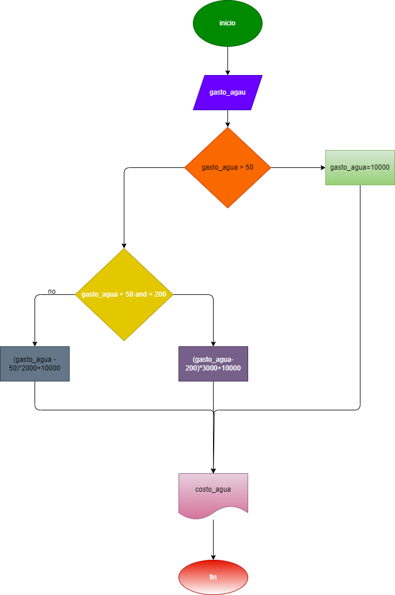

# CALCULAR EL GASTO DE AGUA DE UNA VIVIENDA DADO EL NUMERO EN M3 DE AGUA SEGUN LAS SIGUIENTES NORMAS :
LA CUOTA FIJA MENSUAL ES DE 10000
LOS PRIMEROS 50 M CUBICOS SON GRATIS
ENTRE 50 Y 200 M3 SE COBRA EL M3 A 2000
APARTIR DE  200 M3 SE COBRA EL M3 A 3000

